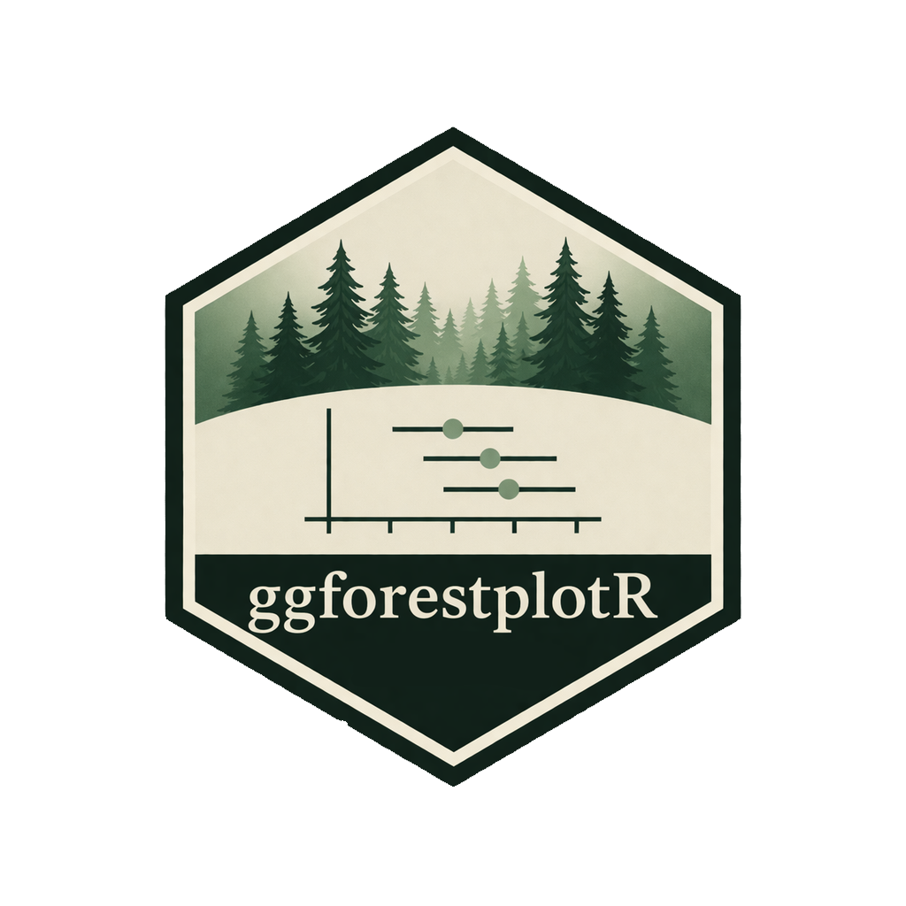
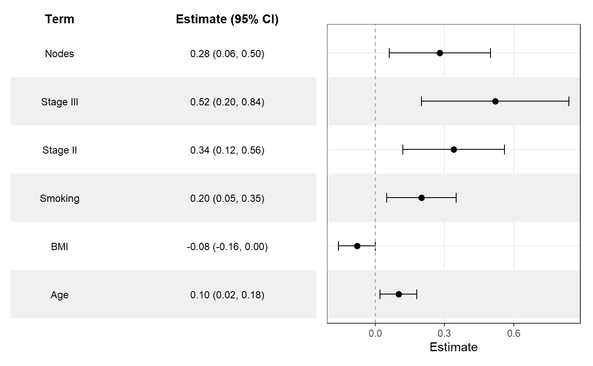
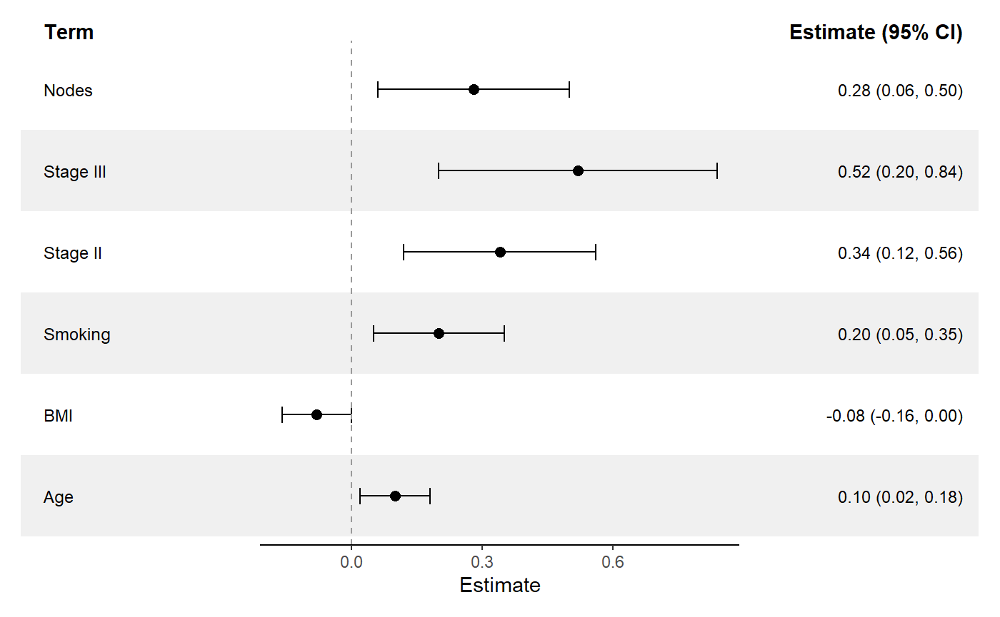

# ggforestplotR 
___
<!-- badges: start -->
  [](https://github.com/thatoneguy006/ggforestplotR/actions/workflows/R-CMD-check.yaml)
<!-- badges: end -->

## Overview
`ggforestplotR` provides a `ggplot2`-first workflow for building forest plots
from tidy coefficient tables or fitted model objects.

## Installation

### CRAN
```r
install.packages("ggforestplotR")
```

### Development

```r
#install.packages("remotes")
remotes::install_github("thatoneguy006/ggforestplotR")
```

## Supported workflows

`ggforestplotR` currently supports two core workflows:

- Plot directly from a table of coefficient data.
- Plot using data from a fitted model object.

## Basic example

```r
library(ggforestplotR)
library(ggplot2)

sectioned_coefs <- data.frame(
  term = c("Age", "BMI", "Smoking", "Stage II", "Stage III", "Nodes"),
  estimate = c(0.10, -0.08, 0.20, 0.34, 0.52, 0.28),
  conf.low = c(0.02, -0.16, 0.05, 0.12, 0.20, 0.06),
  conf.high = c(0.18, 0.00, 0.35, 0.56, 0.84, 0.50),
  section = c("Clinical", "Clinical", "Clinical", "Tumor", "Tumor", "Tumor")
)

ggforestplot(
  sectioned_coefs,
  grouping = "section",
  striped_rows = TRUE,
  stripe_fill = "grey94",
  grouping_strip_position = "right"
)
```


## Add a summary table
```r
ggforestplot(
  sectioned_coefs,
  striped_rows = TRUE,
  stripe_fill = "grey94"
) +
  add_forest_table()
```



## Add a split summary table
```r
ggforestplot(
  sectioned_coefs,
  striped_rows = TRUE,
  stripe_fill = "grey94"
) +
  add_split_table()
```



## Learn more

- Get started: <https://thatoneguy006.github.io/ggforestplotR/articles/ggforestplotR-get-started.html>
- Plot & Table customization: <https://thatoneguy006.github.io/ggforestplotR/articles/ggforestplotR-plot-customization.html>
- Data helpers: <https://thatoneguy006.github.io/ggforestplotR/articles/ggforestplotR-data-helpers.html>

## Main functions

- `ggforestplot()` builds the plotting panel from a data frame or supported model object.
- `add_forest_table()` attaches a summary table to the left or right side of the plot.
- `add_split_table()` creates a more traditional forestplot layout with table columns on both sides of the plot.
- `as_forest_data()` standardizes custom coefficient data.
- `tidy_forest_model()` converts fitted models into plotting-ready coefficient data.
