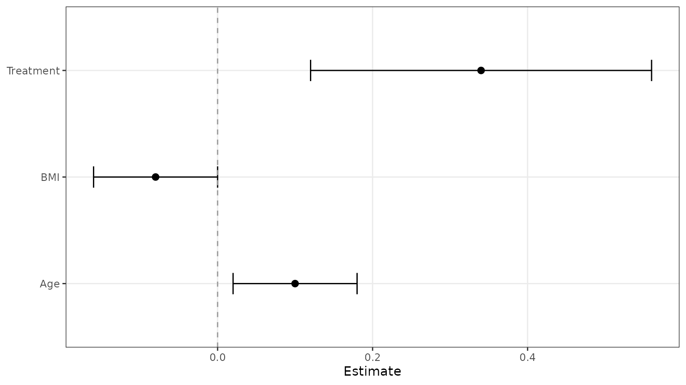
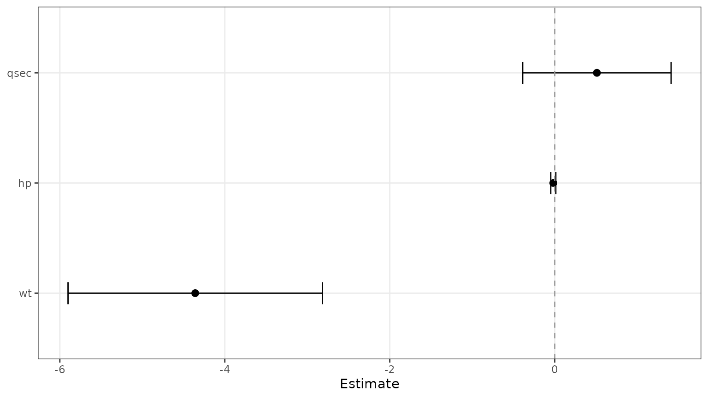

# Prepare Forest Data with Helper Functions

``` r
library(ggforestplotR)
library(ggplot2)
```

This short article covers the two helper functions that prepare data
before the plot is drawn.

## Use `as_forest_data()` to standardize a coefficient table

[`as_forest_data()`](https://thatoneguy006.github.io/ggforestplotR/reference/as_forest_data.md)
converts your column names into the internal structure used by
`ggforestplotR`. The result contains the columns expected by
[`ggforestplot()`](https://thatoneguy006.github.io/ggforestplotR/reference/ggforestplot.md),
[`add_forest_table()`](https://thatoneguy006.github.io/ggforestplotR/reference/add_forest_table.md),
and
[`add_split_table()`](https://thatoneguy006.github.io/ggforestplotR/reference/add_split_table.md).

``` r
raw_coefs <- data.frame(
  variable = c("Age", "BMI", "Treatment"),
  beta = c(0.10, -0.08, 0.34),
  lower = c(0.02, -0.16, 0.12),
  upper = c(0.18, 0.00, 0.56),
  display = c("Age", "BMI", "Treatment"),
  section = c("Clinical", "Clinical", "Treatment"),
  sample_size = c(120, 115, 98),
  p_value = c(0.04, 0.15, 0.001)
)

forest_ready <- as_forest_data(
  data = raw_coefs,
  term = "variable",
  estimate = "beta",
  conf.low = "lower",
  conf.high = "upper",
  label = "display",
  grouping = "section",
  n = "sample_size",
  p.value = "p_value"
)
```

Once the data are standardized, you can pass them straight into
[`ggforestplot()`](https://thatoneguy006.github.io/ggforestplotR/reference/ggforestplot.md).

``` r
ggforestplot(forest_ready)
```



## Use `tidy_forest_model()` for model objects

If `broom` is available,
[`tidy_forest_model()`](https://thatoneguy006.github.io/ggforestplotR/reference/tidy_forest_model.md)
can pull coefficient estimates and confidence limits from a fitted
model.

``` r
fit <- lm(mpg ~ wt + hp + qsec, data = mtcars)

model_ready <- tidy_forest_model(fit)
```

The returned object can be passed directly into
[`ggforestplot()`](https://thatoneguy006.github.io/ggforestplotR/reference/ggforestplot.md).

``` r
ggforestplot(model_ready)
```


