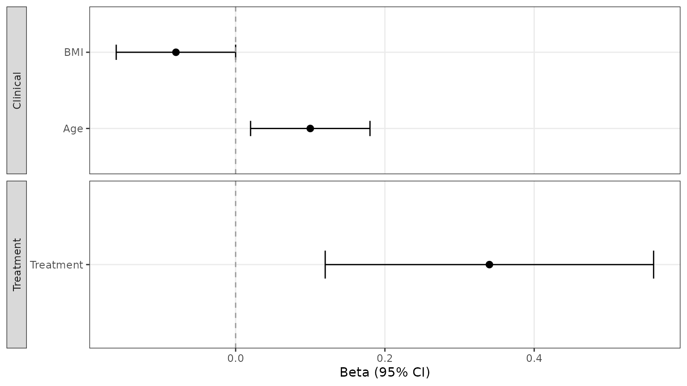
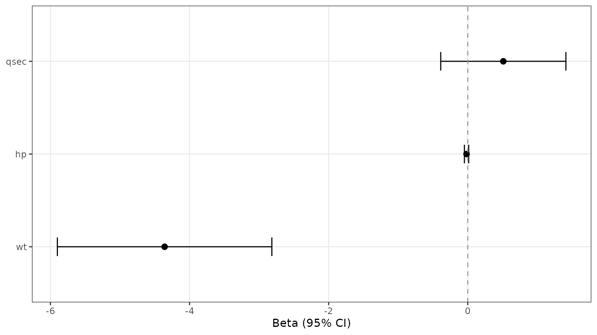
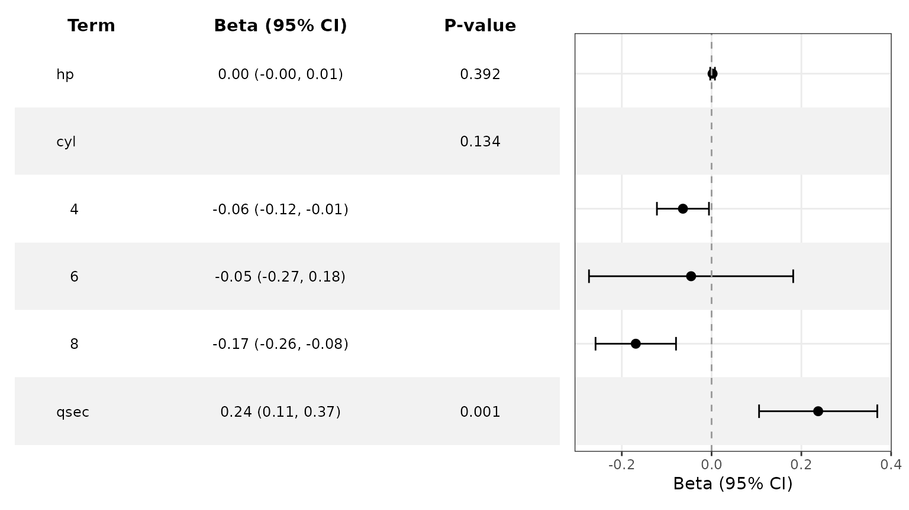
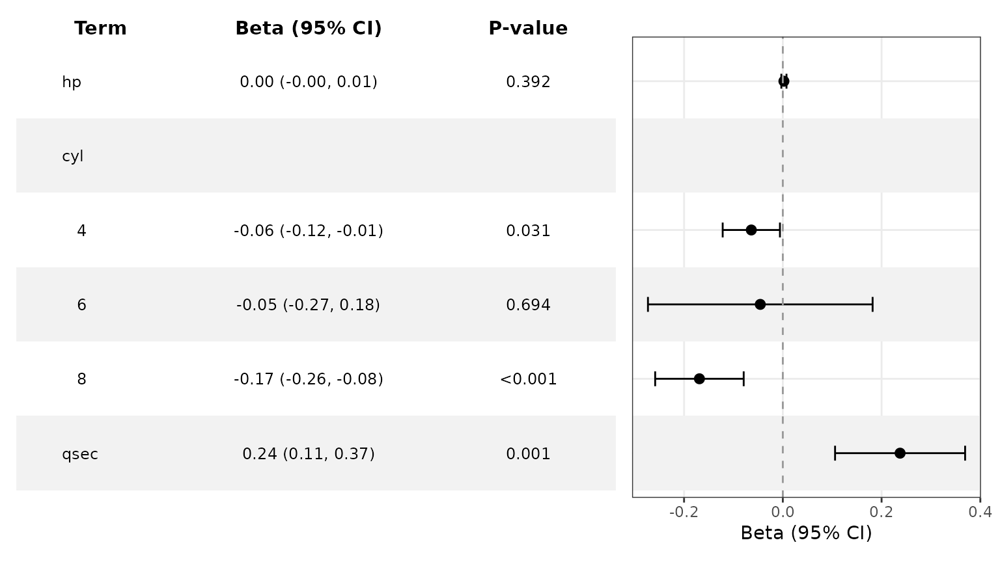

# Prepare Forest Data with Helper Functions

``` r

library(ggforestplotR)
library(ggplot2)
```

This short article covers the `forest_data` interchange object and the
helper functions that prepare it before a plot is drawn.

## Use `as_forest_data()` to standardize a coefficient table

[`as_forest_data()`](https://thatoneguy006.github.io/ggforestplotR/reference/as_forest_data.md)
converts your column names into the internal structure used by
`ggforestplotR`. The result is a `forest_data` data-frame subclass
containing the columns expected by
[`ggforestplot()`](https://thatoneguy006.github.io/ggforestplotR/reference/ggforestplot.md),
[`add_forest_table()`](https://thatoneguy006.github.io/ggforestplotR/reference/add_forest_table.md),
and
[`add_split_table()`](https://thatoneguy006.github.io/ggforestplotR/reference/add_split_table.md).

``` r

raw_coefs <- data.frame(
  variable = c("Age", "BMI", "Treatment"),
  beta = c(0.10, -0.08, 0.34),
  lower = c(0.02, -0.16, 0.12),
  upper = c(0.18, 0.00, 0.56),
  display = c("Age", "BMI", "Treatment"),
  section = c("Clinical", "Clinical", "Treatment"),
  sample_size = c(120, 115, 98),
  p_value = c(0.04, 0.15, 0.001)
)

forest_ready <- as_forest_data(
  data = raw_coefs,
  term = "variable",
  estimate = "beta",
  conf.low = "lower",
  conf.high = "upper",
  label = "display",
  grouping = "section",
  n = "sample_size",
  p.value = "p_value",
  estimate_scale = "identity",
  effect_label = "Beta",
  conf.level = 0.95
)
```

Use
[`forest_metadata()`](https://thatoneguy006.github.io/ggforestplotR/reference/forest_metadata.md)
to inspect the semantic and provenance contract. The complete fitted
model and a duplicate copy of the source data are not retained.

``` r

forest_metadata(forest_ready)[c(
  "estimate_scale", "axis_transform", "effect_label", "conf_level",
  "reference_value", "source_model", "source_package", "source_columns"
)]
#> $estimate_scale
#> [1] "identity"
#> 
#> $axis_transform
#> [1] "identity"
#> 
#> $effect_label
#> [1] "Beta"
#> 
#> $conf_level
#> [1] 0.95
#> 
#> $reference_value
#> [1] 0
#> 
#> $source_model
#> NULL
#> 
#> $source_package
#> NULL
#> 
#> $source_columns
#>      variable          beta         lower         upper       display 
#>    "variable"        "beta"       "lower"       "upper"     "display" 
#>       section   sample_size       p_value 
#>     "section" "sample_size"     "p_value"
```

Once the data are standardized, you can pass them straight into
[`ggforestplot()`](https://thatoneguy006.github.io/ggforestplotR/reference/ggforestplot.md).

``` r

ggforestplot(forest_ready)
```



## Use `as_forest_data()` for model objects

If `broom` is available, the model-specific
[`as_forest_data()`](https://thatoneguy006.github.io/ggforestplotR/reference/as_forest_data.md)
method pulls coefficient estimates and confidence limits from a fitted
model. The method also assigns model semantics such as `Beta`, `OR`, or
`HR`.

``` r

fit <- lm(mpg ~ wt + hp + qsec, data = mtcars)

model_ready <- as_forest_data(fit)
```

The returned object can be passed directly into
[`ggforestplot()`](https://thatoneguy006.github.io/ggforestplotR/reference/ggforestplot.md).

``` r

ggforestplot(model_ready)
```



[`tidy_forest_model()`](https://thatoneguy006.github.io/ggforestplotR/reference/tidy_forest_model.md)
remains available as a compatibility wrapper and returns the same
`forest_data` object.

## Derive subgroup effects from an interaction model

For a fitted model with one continuous-by-factor interaction,
`subgroup = "auto"` identifies the factor from model metadata and
estimates the focal variable’s average slope within each observed factor
level.

``` r

interaction_fit <- lm(wt ~ hp + mpg * factor(cyl) + qsec, data = mtcars)

subgroup_ready <- tidy_forest_model(
  interaction_fit,
  subgroup = "auto",
  focal = "mpg"
)

as.data.frame(subgroup_ready)[, c(
  "term", "subgroup", "estimate", "conf.low", "conf.high", "p.value"
)]
#>   term subgroup     estimate     conf.low    conf.high     p.value
#> 1   hp     <NA>  0.002211858 -0.003019553  0.007443269 0.391515516
#> 2    4      cyl -0.063790596 -0.121755535 -0.005825657 0.133731900
#> 3    6      cyl -0.045622115 -0.273154167  0.181909936 0.133731900
#> 4    8      cyl -0.168851554 -0.258483642 -0.079219466 0.133731900
#> 5 qsec     <NA>  0.237491332  0.105815640  0.369167024 0.001059097

ggforestplot(subgroup_ready, striped_rows = TRUE) +
  add_forest_table(columns = c("term", "estimate", "p"))
```



These rows are average `mpg` slopes within the `cyl` levels. They come
from
[`marginaleffects::avg_slopes()`](https://rdrr.io/pkg/marginaleffects/man/slopes.html)
using the original model and its covariance matrix. No subgroup-specific
models are refitted. The focal main effect, factor main-effect
coefficients, and raw interaction coefficients are replaced by the
derived block; unrelated coefficients remain standalone in formula
order.

The same interaction can be selected explicitly:

``` r

tidy_forest_model(
  interaction_fit,
  subgroup = "cyl",
  focal = "mpg"
)
#> <forest_data> Beta; scale: identity; reference: 0
#>   term     estimate     conf.low    conf.high label group subgroup grouping
#> 1   hp  0.002211858 -0.003019553  0.007443269    hp  <NA>     <NA>     <NA>
#> 2    4 -0.063790596 -0.121755535 -0.005825657     4  <NA>      cyl     <NA>
#> 3    6 -0.045622115 -0.273154167  0.181909936     6  <NA>      cyl     <NA>
#> 4    8 -0.168851554 -0.258483642 -0.079219466     8  <NA>      cyl     <NA>
#> 5 qsec  0.237491332  0.105815640  0.369167024  qsec  <NA>     <NA>     <NA>
#>   separate_groups    n events     p.value   std.error  statistic df
#> 1            <NA> <NA>   <NA> 0.391515516 0.002534723  0.8726232 NA
#> 2            <NA> <NA>   <NA> 0.133731900 0.029574492 -2.1569465 NA
#> 3            <NA> <NA>   <NA> 0.133731900 0.116089915 -0.3929895 NA
#> 4            <NA> <NA>   <NA> 0.133731900 0.045731497 -3.6922376 NA
#> 5            <NA> <NA>   <NA> 0.001059097 0.063799498  3.7224640 NA
#>   subgroup_level focal      model_term contrast      estimand effect_scale
#> 1           <NA>  <NA>            <NA>     <NA>          <NA>         <NA>
#> 2              4   mpg mpg:factor(cyl)    dY/dX average_slope     identity
#> 3              6   mpg mpg:factor(cyl)    dY/dX average_slope     identity
#> 4              8   mpg mpg:factor(cyl)    dY/dX average_slope     identity
#> 5           <NA>  <NA>            <NA>     <NA>          <NA>         <NA>
```

Automatic selection currently requires exactly one unambiguous
continuous-by-factor interaction. Factor-by-factor effects require
explicit predictor names and use
[`marginaleffects::avg_comparisons()`](https://rdrr.io/pkg/marginaleffects/man/comparisons.html).
Continuous subgroups, transformed focal terms, multiple selected
interactions, and three-way interactions are rejected. Logistic and Cox
effects are calculated on their model scale and shown as odds ratios and
hazard ratios by default, not as marginal probabilities or survival
probabilities.

The canonical `p.value` combines two compatible display roles: ordinary
covariates retain their coefficient p-values, while every derived
subgroup block receives an omnibus Wald test of the selected
interaction. The display layer moves that interaction p-value to the
subgroup header and leaves the individual levels blank, so one table
column can present both kinds of tests.

Use `p_method = "level"` when the subgroup-specific slope or comparison
tests are the quantities that should appear beside the individual
estimates:

``` r

level_p_ready <- tidy_forest_model(
  interaction_fit,
  subgroup = "auto",
  focal = "mpg",
  p_method = "level"
)

ggforestplot(level_p_ready, striped_rows = TRUE) +
  add_forest_table(columns = c("term", "estimate", "p"))
```



Both methods use the same canonical `p.value` column. `"overall"`
changes the test and places it on the subgroup header; `"level"` retains
the tests returned for the derived effects and places them on the
subgroup rows.
