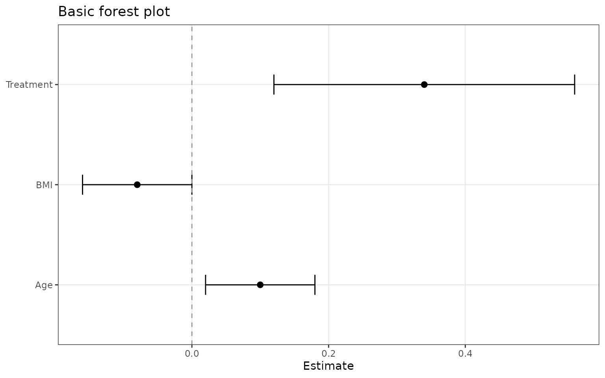
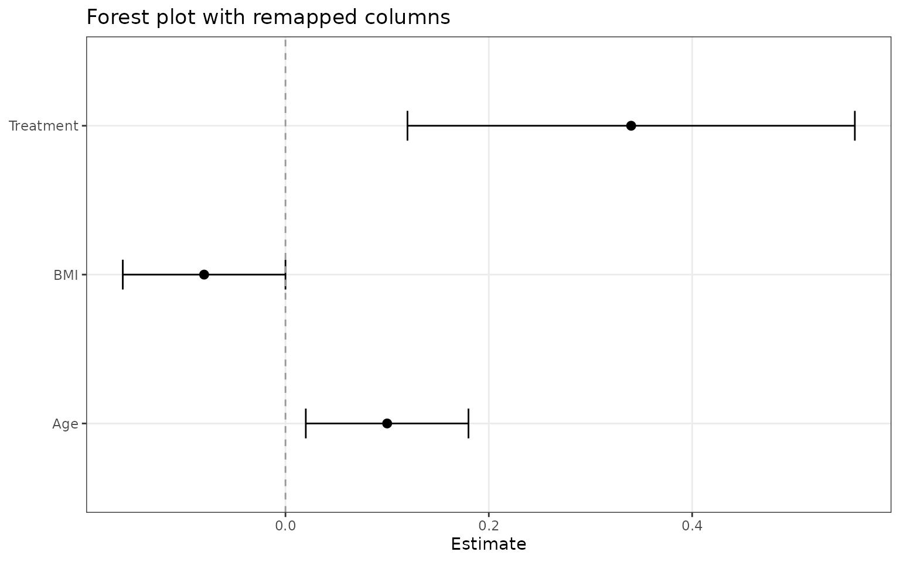
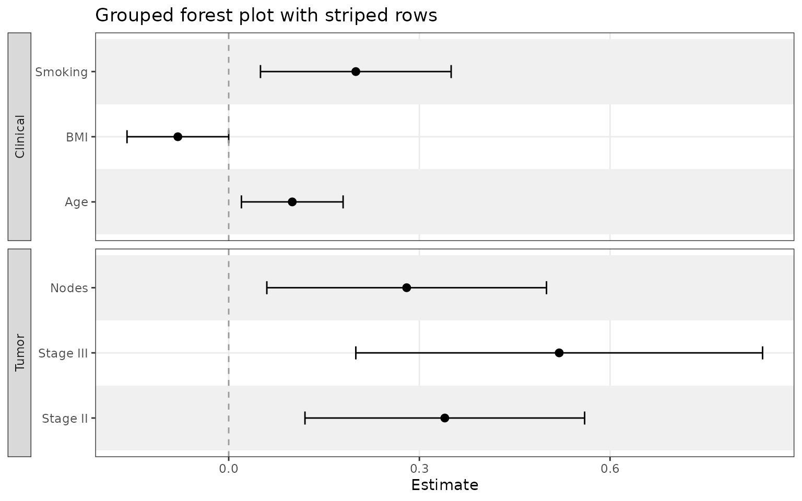
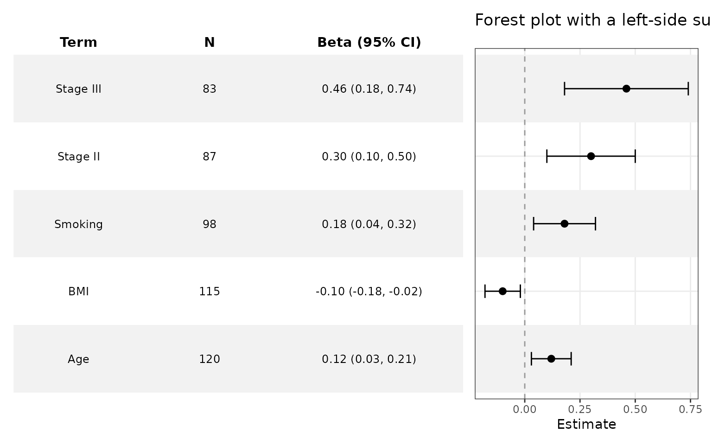
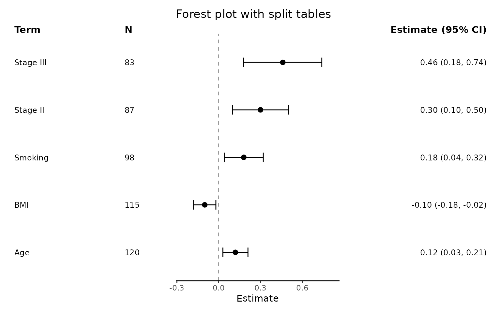
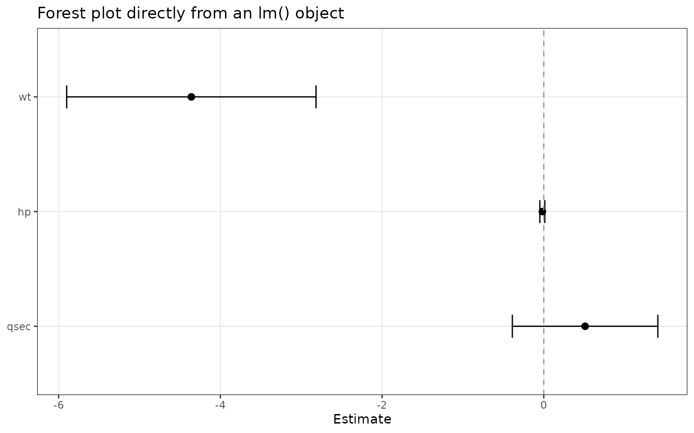

# Get Started with ggforestplotR

``` r
library(ggforestplotR)
library(ggplot2)
```

`ggforestplotR` is built for coefficient-driven forest plots that stay
inside a normal `ggplot2` workflow.

## Choose a workflow

Use the package in one of three ways:

1.  Start from a coefficient table and map the required columns
    directly.
2.  Start from a fitted model and let
    [`tidy_forest_model()`](https://thatoneguy006.github.io/ggforestplotR/reference/tidy_forest_model.md)
    or
    [`ggforestplot()`](https://thatoneguy006.github.io/ggforestplotR/reference/ggforestplot.md)
    call
    [`broom::tidy()`](https://generics.r-lib.org/reference/tidy.html).
3.  Add
    [`add_forest_table()`](https://thatoneguy006.github.io/ggforestplotR/reference/add_forest_table.md)
    or
    [`add_split_table()`](https://thatoneguy006.github.io/ggforestplotR/reference/add_split_table.md)
    after styling the main plot.

This article covers the basic entry points and the minimum data you
need.

## Start from a coefficient table

The simplest input is a data frame with a term, estimate, and confidence
limits.

``` r
basic_coefs <- data.frame(
  term = c("Age", "BMI", "Treatment"),
  estimate = c(0.10, -0.08, 0.34),
  conf.low = c(0.02, -0.16, 0.12),
  conf.high = c(0.18, 0.00, 0.56)
)

ggforestplot(basic_coefs) +
  ggplot2::labs(title = "Basic forest plot")
```



If your columns use different names, map them explicitly.

``` r
renamed_coefs <- data.frame(
  variable = c("Age", "BMI", "Treatment"),
  beta = c(0.10, -0.08, 0.34),
  lower = c(0.02, -0.16, 0.12),
  upper = c(0.18, 0.00, 0.56)
)

ggforestplot(
  renamed_coefs,
  term = "variable",
  estimate = "beta",
  conf.low = "lower",
  conf.high = "upper"
) +
  ggplot2::labs(title = "Forest plot with remapped columns")
```



## Add grouped sections and row striping

Use `grouping` when you want related variables separated into labeled
panels. Add `striped_rows = TRUE` when a larger display benefits from
clearer row tracking.

``` r
sectioned_coefs <- data.frame(
  term = c("Age", "BMI", "Smoking", "Stage II", "Stage III", "Nodes"),
  estimate = c(0.10, -0.08, 0.20, 0.34, 0.52, 0.28),
  conf.low = c(0.02, -0.16, 0.05, 0.12, 0.20, 0.06),
  conf.high = c(0.18, 0.00, 0.35, 0.56, 0.84, 0.50),
  section = c("Clinical", "Clinical", "Clinical", "Tumor", "Tumor", "Tumor")
)

ggforestplot(
  sectioned_coefs,
  grouping = "section",
  striped_rows = TRUE,
  stripe_fill = "grey94"
) +
  ggplot2::labs(title = "Grouped forest plot with striped rows")
```



## Add a side table

Use
[`add_forest_table()`](https://thatoneguy006.github.io/ggforestplotR/reference/add_forest_table.md)
after you finish the main `ggplot2` styling.

``` r
tabled_coefs <- data.frame(
  term = c("Age", "BMI", "Smoking", "Stage II", "Stage III"),
  estimate = c(0.12, -0.10, 0.18, 0.30, 0.46),
  conf.low = c(0.03, -0.18, 0.04, 0.10, 0.18),
  conf.high = c(0.21, -0.02, 0.32, 0.50, 0.74),
  sample_size = c(120, 115, 98, 87, 83)
)

ggforestplot(tabled_coefs, n = "sample_size", striped_rows = TRUE) +
  ggplot2::labs(title = "Forest plot with a left-side summary table") +
  add_forest_table(
    position = "left",
    show_n = TRUE,
    estimate_label = "Beta"
  )
```



## Add split tables

Use
[`add_split_table()`](https://thatoneguy006.github.io/ggforestplotR/reference/add_split_table.md)
when the term columns should stay on the left and the summary statistics
should move to the right.

``` r
ggforestplot(tabled_coefs, n = "sample_size") +
  ggplot2::labs(title = "Forest plot with split tables") +
  add_split_table(
    left_columns = c("term", "n"),
    right_columns = c("estimate")
  )
```



## Start from a fitted model

If `broom` is installed,
[`ggforestplot()`](https://thatoneguy006.github.io/ggforestplotR/reference/ggforestplot.md)
can work directly from a fitted model.

``` r
fit <- lm(mpg ~ wt + hp + qsec, data = mtcars)

ggforestplot(fit, sort_terms = "descending") +
  ggplot2::labs(title = "Forest plot directly from an lm() object")
```



## Next articles

For more detail, see:

- `ggforestplotR-plot-customization` for styling, separators, and table
  layouts.
- `ggforestplotR-data-helpers` for
  [`as_forest_data()`](https://thatoneguy006.github.io/ggforestplotR/reference/as_forest_data.md)
  and
  [`tidy_forest_model()`](https://thatoneguy006.github.io/ggforestplotR/reference/tidy_forest_model.md).
