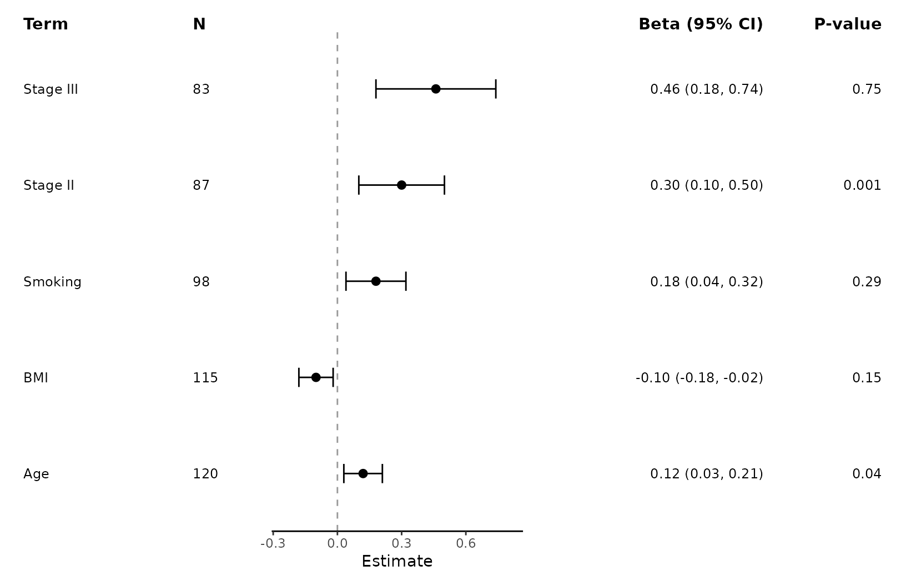
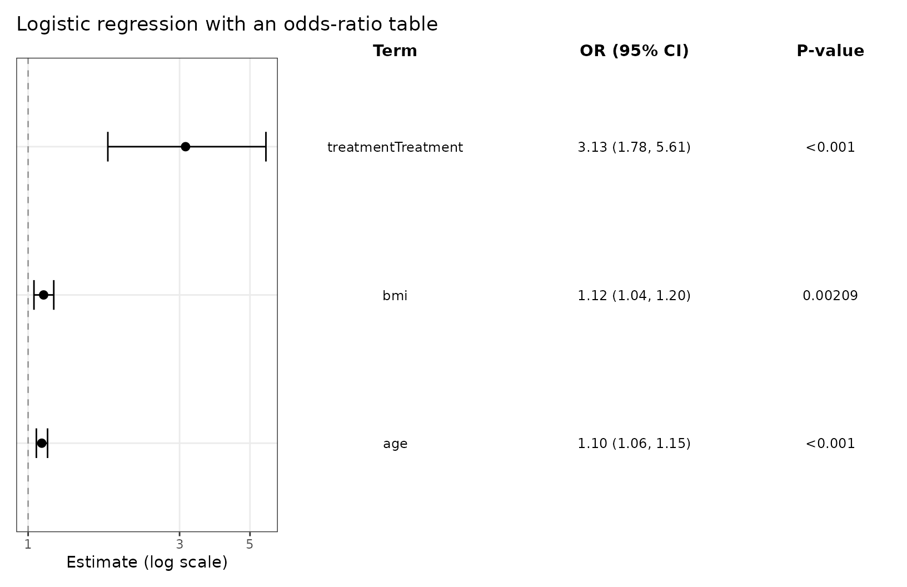
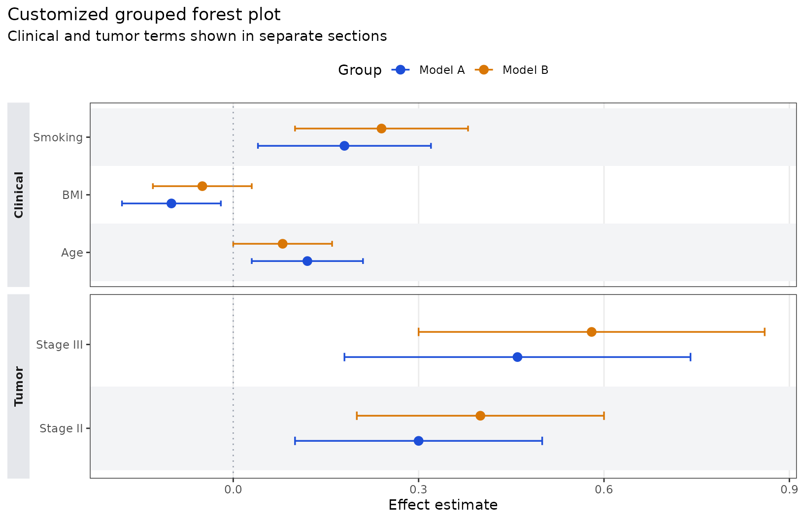

# Customize Forest Plots and Tables

``` r
library(ggforestplotR)
library(ggplot2)
```

This article focuses on grouped displays, separator lines, table
composition, and `ggplot2` styling.

## Base plotting data

``` r
coefs <- data.frame(
  term = c("Age", "BMI", "Smoking", "Stage II", "Stage III"),
  estimate = c(0.12, -0.10, 0.18, 0.30, 0.46),
  conf.low = c(0.03, -0.18, 0.04, 0.10, 0.18),
  conf.high = c(0.21, -0.02, 0.32, 0.50, 0.74),
  sample_size = c(120, 115, 98, 87, 83),
  p_value = c(0.04, 0.15, 0.29, 0.001, 0.75),
  section = c("Clinical", "Clinical", "Clinical", "Tumor", "Tumor")
)
```

## Group rows and control strip placement

`grouping` creates section panels, and `grouping_strip_position`
controls which side gets the strip labels.

``` r
ggforestplot(
  coefs,
  grouping = "section",
  grouping_strip_position = "right",
  striped_rows = TRUE
) +
  ggplot2::labs(title = "Grouped forest plot with right-side strips")
```


## Add separator lines around a multi-level variable

Use `separator_group` and `separator_lines` when a categorical variable
expands into several levels and you want visible boundaries around that
block.

``` r
race_coefs <- data.frame(
  term = c("race_black", "race_white", "race_other", "age", "bmi"),
  label = c("Black", "White", "Other", "Age", "BMI"),
  estimate = c(0.24, 0.08, -0.04, 0.12, -0.09),
  conf.low = c(0.10, -0.04, -0.18, 0.03, -0.17),
  conf.high = c(0.38, 0.20, 0.10, 0.21, -0.01),
  variable_block = c("Race", "Race", "Race", "Age", "BMI")
)

ggforestplot(
  race_coefs,
  label = "label",
  separator_group = "variable_block",
  separator_lines = TRUE,
  striped_rows = TRUE
) +
  ggplot2::labs(title = "Separator lines around a multi-level Race variable")
```


## Add a side table

[`add_forest_table()`](https://thatoneguy006.github.io/ggforestplotR/reference/add_forest_table.md)
is the simpler composition helper when all summary columns should sit on
one side of the plot. Add it last, after the main plot styling, because
it returns a patchwork composition rather than a plain `ggplot`.

``` r
ggforestplot(
  coefs,
  grouping = "section",
  n = "sample_size",
  p.value = "p_value",
  striped_rows = TRUE
) +
  ggplot2::labs(title = "Left-side summary table") +
  add_forest_table(
    position = "left",
    show_n = TRUE,
    show_p = TRUE,
    estimate_label = "Beta"
  )
```


## Use split tables

[`add_split_table()`](https://thatoneguy006.github.io/ggforestplotR/reference/add_split_table.md)
is better when term labels should stay on the left and the formatted
statistics should move to the right. Like
[`add_forest_table()`](https://thatoneguy006.github.io/ggforestplotR/reference/add_forest_table.md),
it should be added after any plot-level styling.

``` r
ggforestplot(
  coefs,
  n = "sample_size",
  p.value = "p_value",
  striped_rows = TRUE
) +
  ggplot2::labs(title = "Split table layout") +
  add_split_table(
    left_columns = c("term", "n"),
    right_columns = c("estimate", "p"),
    estimate_label = "Beta"
  )
```


You can also specify split-table columns by position instead of name.

``` r
ggforestplot(
  coefs,
  n = "sample_size",
  p.value = "p_value"
) +
  add_split_table(
    left_columns = c(1, 2),
    right_columns = c(3, 4),
    estimate_label = "Beta"
  )
```



## Plot odds ratios from logistic regression

For logistic regression models, use `exponentiate = TRUE` so the x-axis
is on an odds-ratio scale and the null reference stays at 1.

``` r
set.seed(123)

logit_data <- data.frame(
  age = rnorm(250, mean = 62, sd = 8),
  bmi = rnorm(250, mean = 28, sd = 4),
  treatment = factor(rbinom(250, 1, 0.45), labels = c("Control", "Treatment"))
)

linpred <- -9 +
  0.09 * logit_data$age +
  0.11 * logit_data$bmi +
  0.9 * (logit_data$treatment == "Treatment")

logit_data$event <- rbinom(250, 1, plogis(linpred))

logit_fit <- glm(event ~ age + bmi + treatment, data = logit_data, family = binomial())
```

``` r
ggforestplot(logit_fit, exponentiate = TRUE) +
  ggplot2::labs(
    title = "Odds ratios from a logistic regression model",
    x = "Odds ratio"
  )
```


You can attach a table here as well and relabel the estimate column for
odds ratios explicitly.

``` r
ggforestplot(logit_fit, exponentiate = TRUE) +
  ggplot2::labs(title = "Logistic regression with an odds-ratio table") +
  add_forest_table(position = "right", estimate_label = "OR", show_p = TRUE)
```



## Compare multiple estimates per term

The `group` argument is for multiple estimates on the same row.

``` r
comparison_coefs <- data.frame(
  term = rep(c("Age", "BMI", "Smoking", "Stage II", "Stage III"), 2),
  estimate = c(0.12, -0.10, 0.18, 0.30, 0.46, 0.08, -0.05, 0.24, 0.40, 0.58),
  conf.low = c(0.03, -0.18, 0.04, 0.10, 0.18, 0.00, -0.13, 0.10, 0.20, 0.30),
  conf.high = c(0.21, -0.02, 0.32, 0.50, 0.74, 0.16, 0.03, 0.38, 0.60, 0.86),
  model = rep(c("Model A", "Model B"), each = 5),
  section = rep(c("Clinical", "Clinical", "Clinical", "Tumor", "Tumor"), 2)
)

ggforestplot(
  comparison_coefs,
  group = "model",
  grouping = "section",
  striped_rows = TRUE,
  dodge_width = 0.5
) +
  ggplot2::labs(title = "Comparing two model specifications")
```


## Finish with ggplot2 styling

The returned object is still a normal `ggplot` until you add a table
helper.

``` r
ggforestplot(
  comparison_coefs,
  group = "model",
  grouping = "section",
  striped_rows = TRUE,
  stripe_fill = "#F3F4F6",
  zero_line_colour = "#9CA3AF",
  zero_line_linetype = 3,
  point_size = 2.8,
  line_size = 0.6
) +
  ggplot2::labs(
    title = "Customized grouped forest plot",
    x = "Effect estimate",
    subtitle = "Clinical and tumor terms shown in separate sections"
  ) +
  ggplot2::scale_colour_manual(
    values = c("Model A" = "#1D4ED8", "Model B" = "#D97706")
  ) +
  ggplot2::theme(
    legend.position = "top",
    panel.grid.major.y = ggplot2::element_blank(),
    strip.background = ggplot2::element_rect(fill = "#E5E7EB", colour = NA),
    strip.text.y.left = ggplot2::element_text(face = "bold"),
    plot.title.position = "plot"
  )
```


