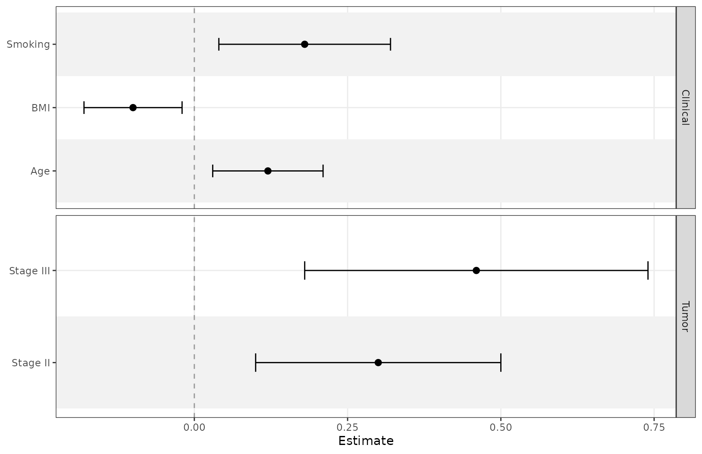
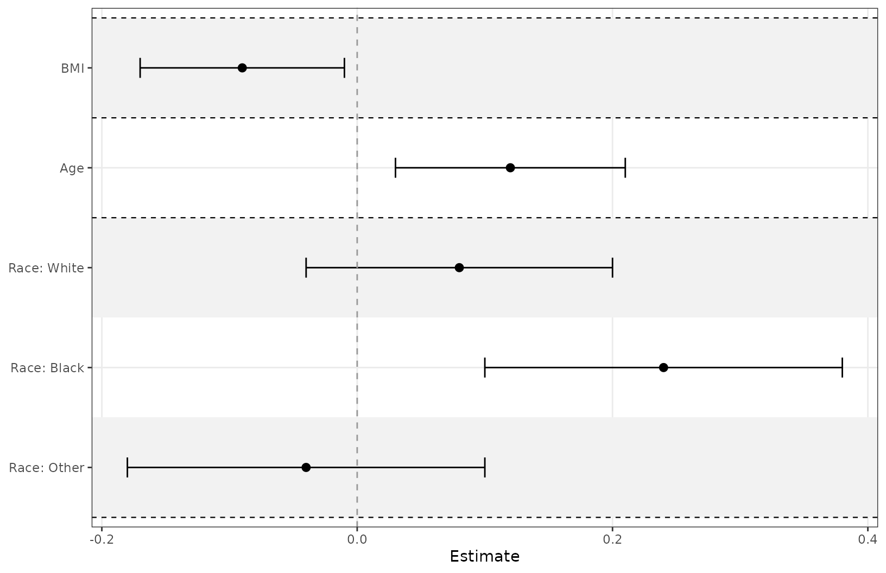
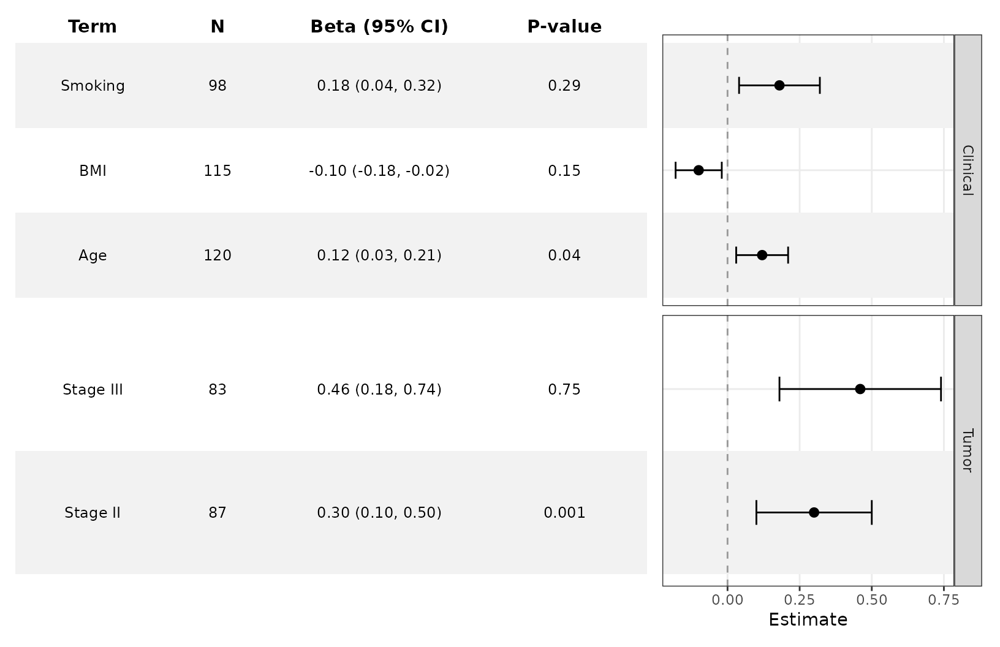
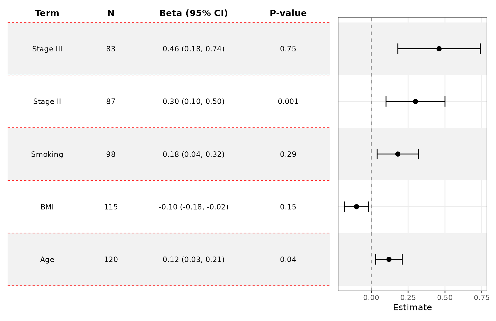
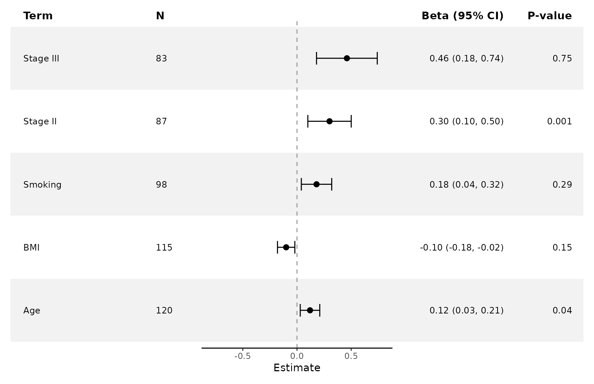
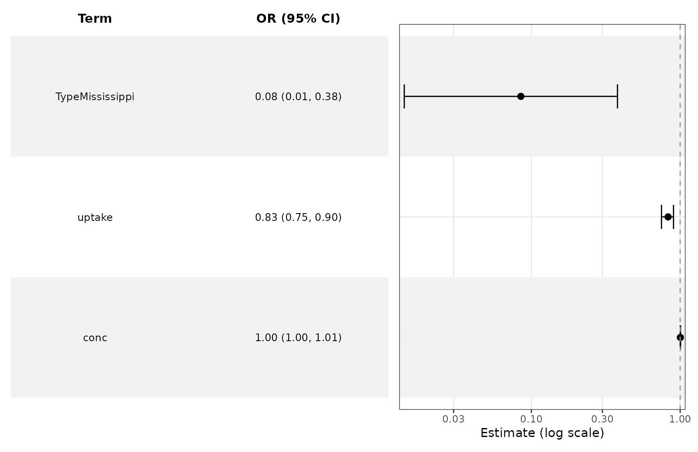
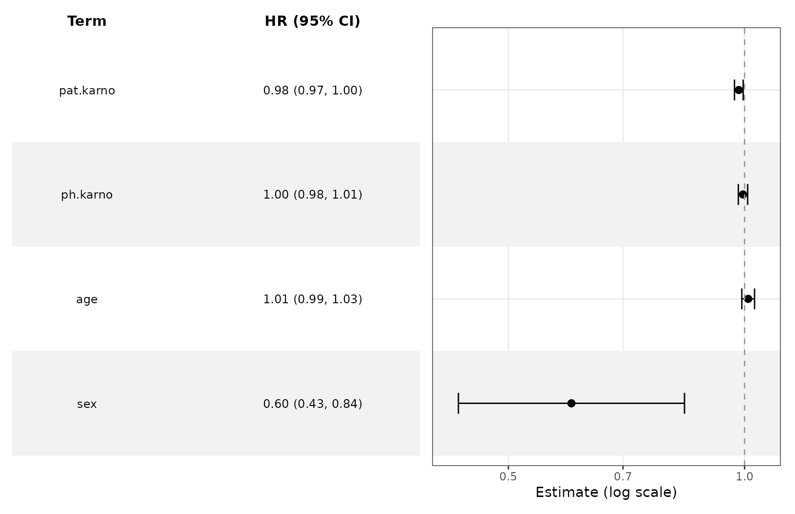
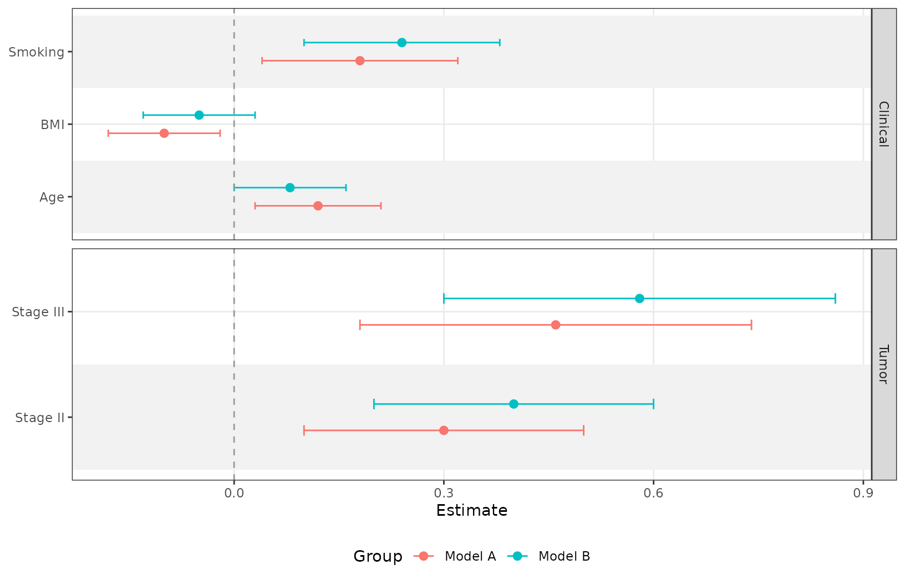

# Customize Forest Plots and Tables

``` r
library(ggforestplotR)
library(ggplot2)
```

This article focuses on utility and enhanced customization of forest
plots and accompanied tables.

## Base plotting data

``` r
coefs <- data.frame(
  term = c("Age", "BMI", "Smoking", "Stage II", "Stage III"),
  estimate = c(0.12, -0.10, 0.18, 0.30, 0.46),
  conf.low = c(0.03, -0.18, 0.04, 0.10, 0.18),
  conf.high = c(0.21, -0.02, 0.32, 0.50, 0.74),
  sample_size = c(120, 115, 98, 87, 83),
  p_value = c(0.04, 0.15, 0.29, 0.001, 0.75),
  section = c("Clinical", "Clinical", "Clinical", "Tumor", "Tumor")
)
```

## Group rows and control strip placement

`grouping` creates section panels, and `grouping_strip_position`
controls which side gets the strip labels.

``` r
ggforestplot(
  coefs,
  grouping = "section",
  grouping_strip_position = "right",
  striped_rows = TRUE
)
```



## Distinct variable separation

Use `separate_groups` and `separate_lines` when you want a more distinct
visual separation between variables. This is especially useful for
categorical variables with many levels. `separate_groups` automatically
appends the variable name to the level.

``` r
block_coefs <- data.frame(
  term = c("race_black", "race_white", "race_other", "age", "bmi"),
  label = c("Black", "White", "Other", "Age", "BMI"),
  estimate = c(0.24, 0.08, -0.04, 0.12, -0.09),
  conf.low = c(0.10, -0.04, -0.18, 0.03, -0.17),
  conf.high = c(0.38, 0.20, 0.10, 0.21, -0.01),
  variable_block = c("Race", "Race", "Race", "Age", "BMI")
)

ggforestplot(
  block_coefs,
  label = "label",
  separate_groups = "variable_block",
  separate_lines = TRUE,
  striped_rows = TRUE
) +
  scale_y_discrete(limits = rev(c("BMI", "Age", "Race: White", 
                                  "Race: Black", "Race: Other")))
#> Scale for y is already present.
#> Adding another scale for y, which will replace the existing scale.
```



## Add a side table

[`add_forest_table()`](https://thatoneguy006.github.io/ggforestplotR/reference/add_forest_table.md)
allows you to attach model information to the coefficient plot. The
table can be added to either the left or right side and allows for some
customization. You should **always** add the table **LAST**, after
styling your plot because the function calls on `patchwork` internally.
`patchwork` requires specific syntax to customize plots and is generally
more difficult to get working correctly.

``` r
ggforestplot(
  coefs,
  grouping = "section",
  grouping_strip_position = "right",
  n = "sample_size",
  p.value = "p_value",
  striped_rows = TRUE
) +
  add_forest_table(
    show_n = TRUE,
    show_p = TRUE,
    estimate_label = "Beta"
  )
```



## Customize the table

`add_forest_table` also lets you change some minor styling elements of
the forest table.

``` r
ggforestplot(
  coefs,
  n = "sample_size",
  p.value = "p_value",
  striped_rows = TRUE
) +
  add_forest_table(
    position = "left",
    show_n = TRUE,
    show_p = TRUE,
    estimate_label = "Beta",
    grid_lines = T,
    grid_line_linetype = 2,
    grid_line_colour = "red"
  )
```



## Split tables

[`add_split_table()`](https://thatoneguy006.github.io/ggforestplotR/reference/add_split_table.md)
can be used to create more traditional looking forest plots. You can
choose which summary information goes to which side. Like
[`add_forest_table()`](https://thatoneguy006.github.io/ggforestplotR/reference/add_forest_table.md),
it should be added after any plot-level styling.

``` r
ggforestplot(
  coefs,
  n = "sample_size",
  p.value = "p_value",
  striped_rows = TRUE
) +
  scale_x_continuous(limits = c(-.8,.8)) +
  add_split_table(
    left_columns = c("term","n"),
    right_columns = c("estimate","p"),
    estimate_label = "Beta"
  ) 
```



## Plotting other types of model coefficients

You can use `exponentiate = TRUE` for models on the log-odds scale (or
similar).

``` r
data(CO2)

l1 <- glm(Treatment ~ conc + uptake + Type, family = binomial(link = "logit"), 
    data = CO2)
```

``` r

ggforestplot(l1, exponentiate = TRUE, striped_rows = T) +
  add_forest_table(position = "left", 
                   estimate_label = "OR", 
                   show_p = F)
```



We can do this for survival models as well.

``` r
lung <- survival::lung

lung <- lung |>  
  dplyr::mutate(
    status = dplyr::recode(status, `1` = 0, `2` = 1)
  )

s1 <- survival::coxph(Surv(time, status) ~ sex + age + ph.karno + pat.karno, data = lung)
```

``` r
ggforestplot(s1, exponentiate = T, striped_rows = T) +
  add_forest_table(estimate_label = "HR")
```



## Compare multiple estimates

The `group` argument is handy when comparing estimates from several
models.

``` r
comparison_coefs <- data.frame(
  term = rep(c("Age", "BMI", "Smoking", "Stage II", "Stage III"), 2),
  estimate = c(0.12, -0.10, 0.18, 0.30, 0.46, 0.08, -0.05, 0.24, 0.40, 0.58),
  conf.low = c(0.03, -0.18, 0.04, 0.10, 0.18, 0.00, -0.13, 0.10, 0.20, 0.30),
  conf.high = c(0.21, -0.02, 0.32, 0.50, 0.74, 0.16, 0.03, 0.38, 0.60, 0.86),
  model = rep(c("Model A", "Model B"), each = 5),
  section = rep(c("Clinical", "Clinical", "Clinical", "Tumor", "Tumor"), 2)
)

ggforestplot(
  comparison_coefs,
  group = "model",
  grouping = "section",
  striped_rows = TRUE,
  dodge_width = 0.5,
  grouping_strip_position = "right"
) +
  theme(legend.position = "bottom")
```


