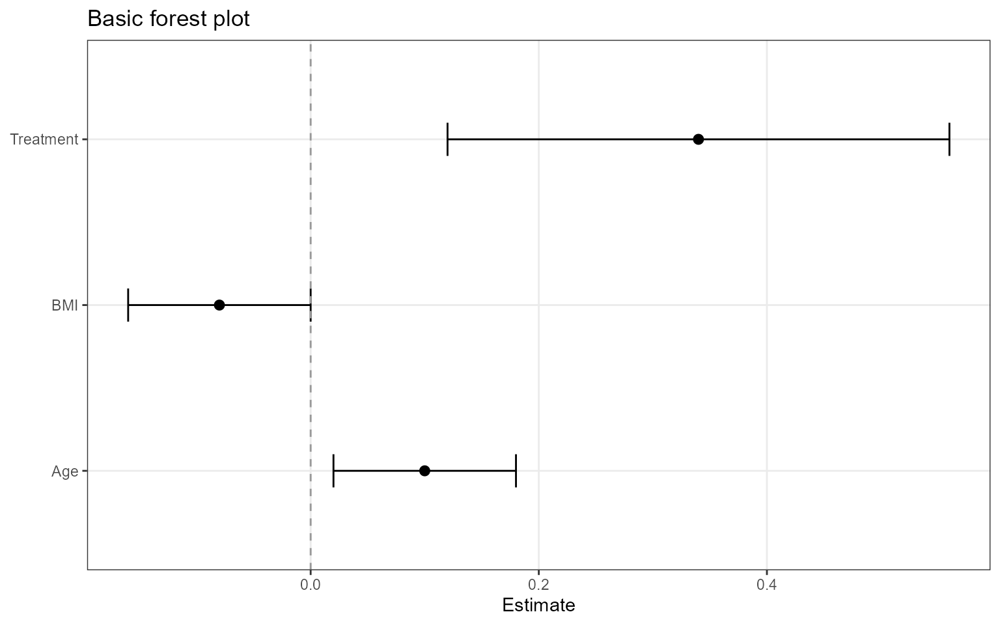
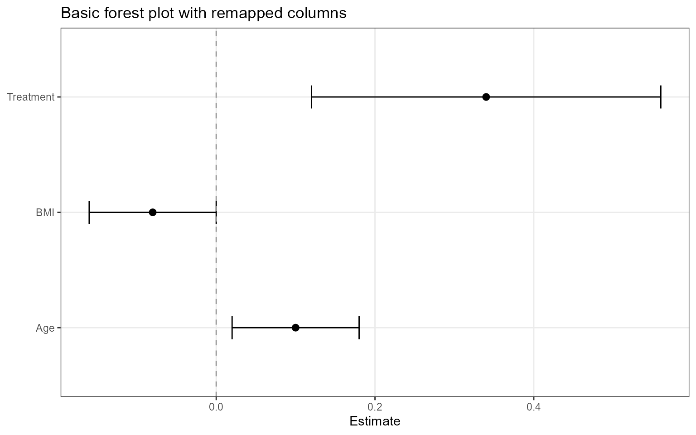
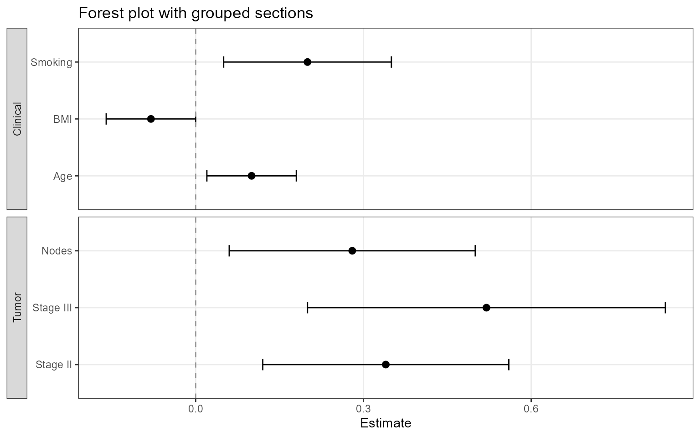
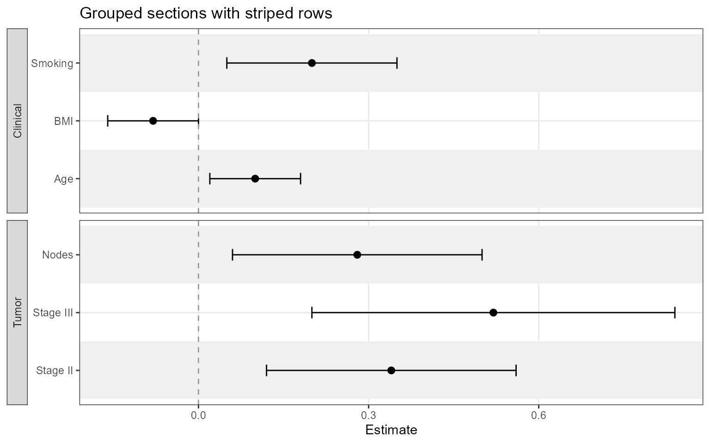
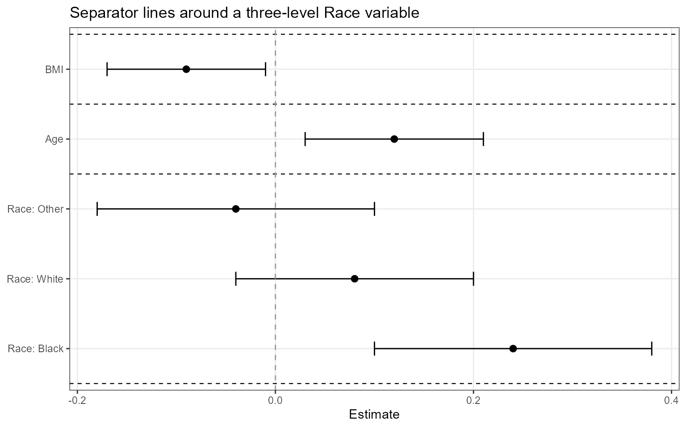
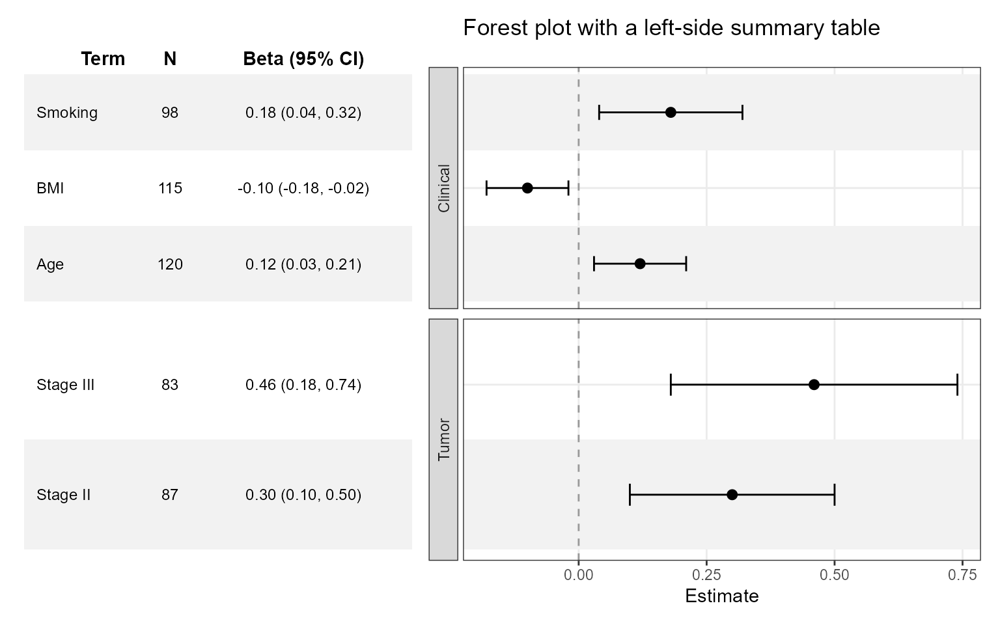
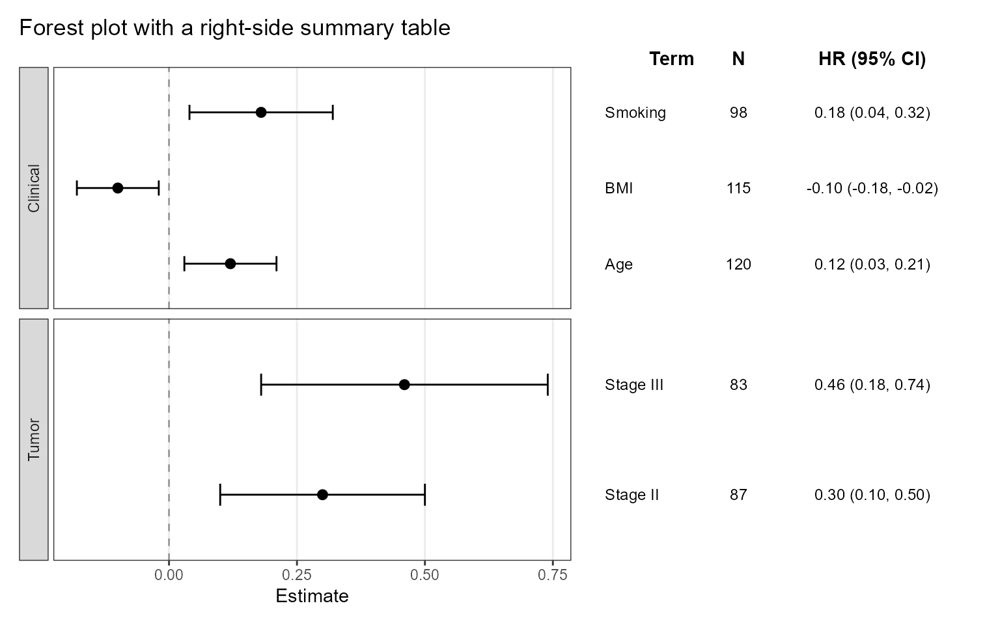
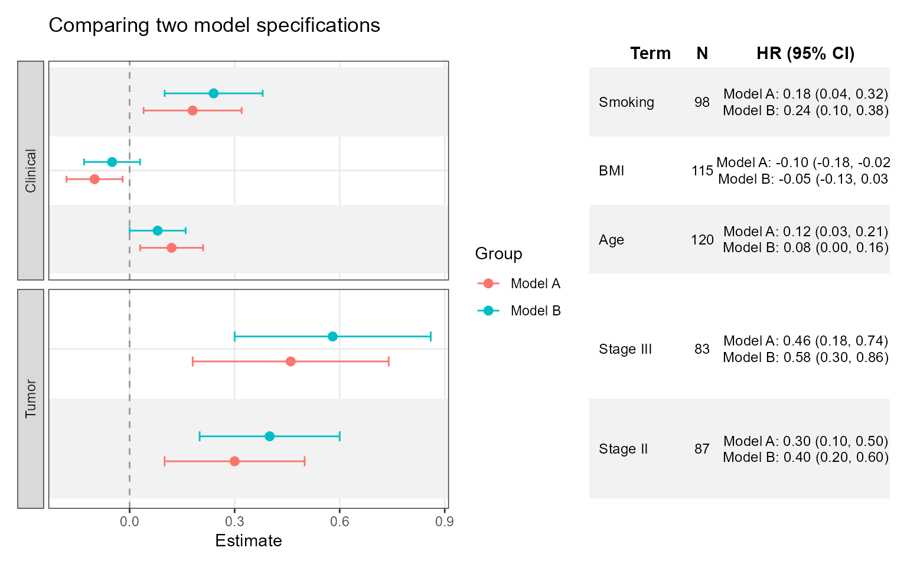
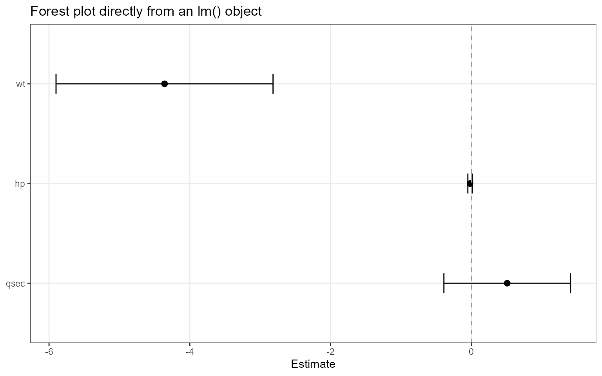
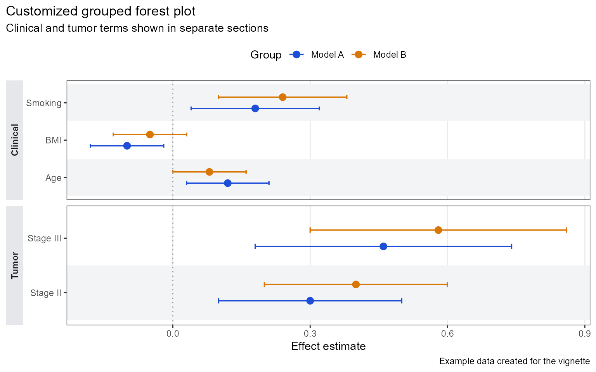

# Getting Started with ggforestplotR

`ggforestplotR` is built to make forest plots feel like part of a normal
`ggplot2` workflow. You can start from a simple coefficient table, scale
up to grouped displays, attach a publication-friendly side table, and
then keep customizing the output with familiar `ggplot2` layers and
themes.

This vignette walks through six increasingly capable patterns:

1.  Build a basic forest plot from a coefficient table
2.  Split rows into grouped sections
3.  Add separator lines for a multi-level variable
4.  Attach a side summary table after styling the plot
5.  Compare multiple estimates for the same terms
6.  Add custom styling on top of the returned `ggplot` object

``` r

library(ggforestplotR)
library(ggplot2)
```

## A basic forest plot

The simplest workflow is to start with a data frame that already
contains a term name, an estimate, and confidence limits.

``` r

basic_coefs <- data.frame(
  term = c("Age", "BMI", "Treatment"),
  estimate = c(0.10, -0.08, 0.34),
  conf.low = c(0.02, -0.16, 0.12),
  conf.high = c(0.18, 0.00, 0.56)
)

ggforestplot(
  basic_coefs,
  title = "Basic forest plot"
)
```



If your column names are different, map them explicitly with the `term`,
`estimate`, `conf.low`, and `conf.high` arguments.

``` r

renamed_coefs <- data.frame(
  variable = c("Age", "BMI", "Treatment"),
  beta = c(0.10, -0.08, 0.34),
  lower = c(0.02, -0.16, 0.12),
  upper = c(0.18, 0.00, 0.56)
)

ggforestplot(
  renamed_coefs,
  term = "variable",
  estimate = "beta",
  conf.low = "lower",
  conf.high = "upper",
  title = "Basic forest plot with remapped columns"
)
```



## Group rows into sections

Many forest plots read better when related variables are visually
grouped together. The `grouping` argument splits the plot into labeled
sections.

``` r

sectioned_coefs <- data.frame(
  term = c("Age", "BMI", "Smoking", "Stage II", "Stage III", "Nodes"),
  estimate = c(0.10, -0.08, 0.20, 0.34, 0.52, 0.28),
  conf.low = c(0.02, -0.16, 0.05, 0.12, 0.20, 0.06),
  conf.high = c(0.18, 0.00, 0.35, 0.56, 0.84, 0.50),
  section = c(
    "Clinical", "Clinical", "Clinical",
    "Tumor", "Tumor", "Tumor"
  )
)

ggforestplot(
  sectioned_coefs,
  grouping = "section",
  title = "Forest plot with grouped sections"
)
```



This is also a good place to turn on alternating row striping.

``` r

ggforestplot(
  sectioned_coefs,
  grouping = "section",
  striped_rows = TRUE,
  stripe_fill = "grey94",
  title = "Grouped sections with striped rows"
)
```



## Add separator lines for a multi-level variable

If a variable expands into several rows, you can identify that block
with `separator_group` and turn on `separator_lines` to draw dashed
rules around the variable block.

``` r

race_coefs <- data.frame(
  term = c("race_black", "race_white", "race_other", "age", "bmi"),
  label = c("Black", "White", "Other", "Age", "BMI"),
  estimate = c(0.24, 0.08, -0.04, 0.12, -0.09),
  conf.low = c(0.10, -0.04, -0.18, 0.03, -0.17),
  conf.high = c(0.38, 0.20, 0.10, 0.21, -0.01),
  variable_block = c("Race", "Race", "Race", "Age", "BMI")
)

ggforestplot(
  race_coefs,
  label = "label",
  separator_group = "variable_block",
  separator_lines = TRUE,
  title = "Separator lines around a three-level Race variable"
)
```



## Attach a side table

Many reporting workflows need both the visual forest plot and a compact
text summary beside it. The recommended workflow is to build the forest
plot first, apply any `ggplot2` styling you need, and then call
[`add_forest_table()`](https://thatoneguy006.github.io/ggforestplotR/reference/add_forest_table.md)
to compose the table on the left or right side.

``` r

tabled_coefs <- data.frame(
  term = c("Age", "BMI", "Smoking", "Stage II", "Stage III"),
  estimate = c(0.12, -0.10, 0.18, 0.30, 0.46),
  conf.low = c(0.03, -0.18, 0.04, 0.10, 0.18),
  conf.high = c(0.21, -0.02, 0.32, 0.50, 0.74),
  sample_size = c(120, 115, 98, 87, 83),
  section = c("Clinical", "Clinical", "Clinical", "Tumor", "Tumor")
)

ggforestplot(
  tabled_coefs,
  grouping = "section",
  n = "sample_size",
  striped_rows = TRUE,
  title = "Forest plot with a left-side summary table"
) +
  add_forest_table(
    position = "left",
    show_n = TRUE,
    estimate_label = "Beta"
  )
```



You can also move the table to the right side and relabel the estimate
header.

``` r

ggforestplot(
  tabled_coefs,
  grouping = "section",
  n = "sample_size",
  title = "Forest plot with a right-side summary table"
) +
  ggplot2::theme(
    panel.grid.major.y = ggplot2::element_blank(),
    plot.title.position = "plot"
  ) +
  add_forest_table(
    position = "right",
    show_n = TRUE,
    estimate_label = "HR"
  )
```



Because
[`add_forest_table()`](https://thatoneguy006.github.io/ggforestplotR/reference/add_forest_table.md)
is called after the plot is built, styling stays local to the forest
plot until the final composition step.

## Compare multiple estimates per term

The `group` argument is for a different kind of grouping: multiple
estimates for the same term. This is useful when comparing models,
cohorts, or timepoints.

``` r

comparison_coefs <- data.frame(
  term = rep(c("Age", "BMI", "Smoking", "Stage II", "Stage III"), 2),
  estimate = c(
    0.12, -0.10, 0.18, 0.30, 0.46,
    0.08, -0.05, 0.24, 0.40, 0.58
  ),
  conf.low = c(
    0.03, -0.18, 0.04, 0.10, 0.18,
    0.00, -0.13, 0.10, 0.20, 0.30
  ),
  conf.high = c(
    0.21, -0.02, 0.32, 0.50, 0.74,
    0.16, 0.03, 0.38, 0.60, 0.86
  ),
  model = rep(c("Model A", "Model B"), each = 5),
  section = rep(c("Clinical", "Clinical", "Clinical", "Tumor", "Tumor"), 2),
  sample_size = rep(c(120, 115, 98, 87, 83), 2)
)

ggforestplot(
  comparison_coefs,
  group = "model",
  grouping = "section",
  n = "sample_size",
  striped_rows = TRUE,
  dodge_width = 0.5,
  title = "Comparing two model specifications"
) +
  add_forest_table(
    position = "right",
    show_n = TRUE,
    estimate_label = "HR"
  )
```



When you pass a `group` column,
[`ggforestplot()`](https://thatoneguy006.github.io/ggforestplotR/reference/ggforestplot.md)
colors each series and dodges the points so the estimates remain
readable. In the attached table, grouped rows are collapsed into a
single text cell per term.

## Start from a fitted model

If you have a model object and `broom` is installed,
[`ggforestplot()`](https://thatoneguy006.github.io/ggforestplotR/reference/ggforestplot.md)
can call
[`broom::tidy()`](https://generics.r-lib.org/reference/tidy.html) for
you. This makes it easy to move from a fitted model to a coefficient
plot without building the table yourself first.

``` r

fit <- lm(mpg ~ wt + hp + qsec, data = mtcars)

ggforestplot(
  fit,
  sort_terms = "descending",
  title = "Forest plot directly from an lm() object"
)
```



If you want to inspect or reuse the intermediate data, call
[`tidy_forest_model()`](https://thatoneguy006.github.io/ggforestplotR/reference/tidy_forest_model.md)
directly.

``` r

tidy_forest_model(fit)
```

## Custom styling with ggplot2

The return value from
[`ggforestplot()`](https://thatoneguy006.github.io/ggforestplotR/reference/ggforestplot.md)
is a regular `ggplot` object when no side table is attached, so you can
continue styling it with scales, labels, and themes.

``` r

ggforestplot(
  comparison_coefs,
  group = "model",
  grouping = "section",
  striped_rows = TRUE,
  stripe_fill = "#F3F4F6",
  zero_line_colour = "#9CA3AF",
  zero_line_linetype = 3,
  point_size = 2.8,
  line_size = 0.6,
  title = "Customized grouped forest plot",
  xlab = "Effect estimate",
  ylab = NULL
) +
  ggplot2::scale_colour_manual(
    values = c("Model A" = "#1D4ED8", "Model B" = "#D97706")
  ) +
  ggplot2::labs(
    subtitle = "Clinical and tumor terms shown in separate sections",
    caption = "Example data created for the vignette"
  ) +
  ggplot2::theme(
    legend.position = "top",
    panel.grid.major.y = ggplot2::element_blank(),
    strip.background = ggplot2::element_rect(fill = "#E5E7EB", colour = NA),
    strip.text.y.left = ggplot2::element_text(face = "bold"),
    plot.title.position = "plot"
  )
```



That last example is the main design idea behind `ggforestplotR`: the
package should handle the repetitive forest-plot mechanics, while still
letting you finish the visual design with the rest of the `ggplot2`
ecosystem.
