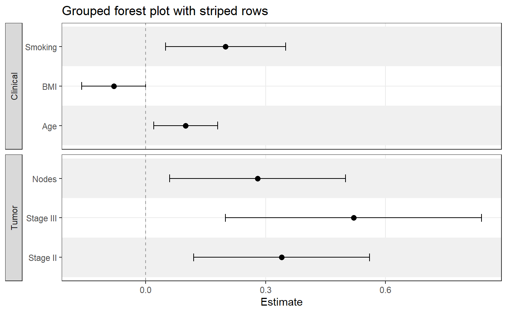

# ggforestplotR

`ggforestplotR` provides a `ggplot2`-first workflow for building forest
plots from tidy coefficient tables or fitted model objects.

## Installation

Install the current development version from GitHub.

``` r
install.packages("remotes")
remotes::install_github("thatoneguy006/ggforestplotR")
```

## Core workflows

The package currently supports three common workflows:

- Build a forest plot directly from a coefficient table
- Start from a fitted model and tidy it for plotting with `broom`
- Add side tables or split-table layouts for reporting-ready output

## Quick example

``` r
library(ggforestplotR)
library(ggplot2)

sectioned_coefs <- data.frame(
  term = c("Age", "BMI", "Smoking", "Stage II", "Stage III", "Nodes"),
  estimate = c(0.10, -0.08, 0.20, 0.34, 0.52, 0.28),
  conf.low = c(0.02, -0.16, 0.05, 0.12, 0.20, 0.06),
  conf.high = c(0.18, 0.00, 0.35, 0.56, 0.84, 0.50),
  section = c("Clinical", "Clinical", "Clinical", "Tumor", "Tumor", "Tumor")
)

ggforestplot(
  sectioned_coefs,
  grouping = "section",
  striped_rows = TRUE,
  stripe_fill = "grey94"
) +
  ggplot2::labs(title = "Grouped forest plot with striped rows")
```



## Learn more

- Get started:
  <https://thatoneguy006.github.io/ggforestplotR/articles/ggforestplotR-get-started.html>
- Plot & Table customization:
  <https://thatoneguy006.github.io/ggforestplotR/articles/ggforestplotR-plot-customization.html>
- Data helpers:
  <https://thatoneguy006.github.io/ggforestplotR/articles/ggforestplotR-data-helpers.html>

## Main functions

- [`ggforestplot()`](https://thatoneguy006.github.io/ggforestplotR/reference/ggforestplot.md)
  builds the plotting panel from a data frame or supported model object.
- [`add_forest_table()`](https://thatoneguy006.github.io/ggforestplotR/reference/add_forest_table.md)
  attaches a summary table to the left or right side of the plot.
- [`add_split_table()`](https://thatoneguy006.github.io/ggforestplotR/reference/add_split_table.md)
  creates a more traditional forestplot with tables on both sides of the
  plot.
- [`as_forest_data()`](https://thatoneguy006.github.io/ggforestplotR/reference/as_forest_data.md)
  standardizes custom coefficient data.
- [`tidy_forest_model()`](https://thatoneguy006.github.io/ggforestplotR/reference/tidy_forest_model.md)
  converts fitted models into plotting-ready coefficient data.
